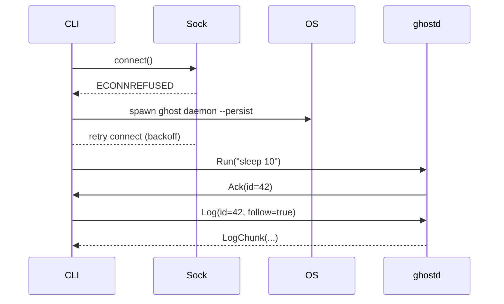

# ghost 設計書

## 0. 目的

 |              | 内容                                                                                          |
 |--------------|-----------------------------------------------------------------------------------------------|
 | **Goal**     | 任意コマンドをバックグラウンド実行し、ID で制御・ログ閲覧できる軽量ツールを Rust で提供する。 |
 | **Non-Goal** | k8s/コンテナを置き換える大規模スケジューラ、リモート実行、ユーザ認証。                        |

---

## 1. 全体アーキテクチャ

```
┌────────────┐ (spawn if absent)  ┌────────────┐
│ ghost CLI  │ ──── connect ────▶ │  ghostd    │
│ (clap)     │                    │  (tokio)   │
└────────────┘                    ├────────────┤
     ▲                            │ Task table │
     │                            │ rusqlite   │
     │                            ├────────────┤
     │                            │ Log buffer │
     │                            │ ringbuf +  │
     │                            │ file rota  │
     │                            └────────────┘
     │                                    ▲
     └──── ratatui “ghost ui” <─ stream ──┘
```

* **ghost CLI** — ソケット接続失敗時に `ghost daemon --persist` をデタッチ起動。  
* **ghostd** — 明示的に `SIGTERM` / `Shutdown RPC` を受けるまで常駐。  
* **IPC** — Unix Domain Socket（Windows は Named Pipe）。JSON/Bincode + length-frame。  
* **ghost ui (TUI)** — CLI 機能をすべてカバーするフロントエンド。  

---

## 2. クレート構成

 | crate          | type | 役割                                                             |
 |----------------|------|------------------------------------------------------------------|
 | `ghost-cli`    | bin  | `run / log / stop / kill / list / shutdown …`。daemon 自動起動。 |
 | `ghost-daemon` | bin  | プロセス生成・監視、ログ配信、状態永続化。                       |
 | `ghost-ui`     | bin  | ratatui TUI。すべての RPC を実行可能。                           |
 | `ghost-proto`  | lib  | `serde` 型 & 共通エラー。                                        |

---

## 3. IPC プロトコル

### 3.1 型

```rust
enum Request {
    Run   { cmd: Vec<String>, env: Vec<(String,String)>, cwd: PathBuf },
    Log   { id: Uuid, follow: bool },
    Stop  { id: Uuid, force: bool },
    List,
    Ping,
    Shutdown,
}
enum Response {
    Ack,
    TaskList(Vec<TaskInfo>),
    LogChunk(Bytes),
    Error(String),
}
```

### 3.2 トランスポート

```
interprocess::local_socket::tokio::Stream
     │
LengthDelimitedCodec (u32)
     │
tokio_serde_json / bincode
```

1 接続でリクエスト／ストリーム応答を多重化。

---

## 4. ランタイムフロー



---

## 5. ghostd モジュール

 | module       | 内容                                                      |
 |--------------|-----------------------------------------------------------|
 | `ipc`        | accept→request dispatch (tokio)。                         |
 | `task_mgr`   | `tokio::process::Command`, `nix::unistd::setsid/killpg`。 |
 | `log_router` | stdout/stderr→`broadcast::Sender`。                       |
 | `storage`    | rusqlite。起動時に孤児タスク検出。                        |
 | `signal`     | OS シグナル→graceful shutdown。                           |

---

## 6. 依存クレート

 | 目的         | crate                                      |
 |--------------|--------------------------------------------|
 | 非同期       | `tokio` (rt-multi-thread, process, signal) |
 | IPC          | `interprocess` (`tokio` feature)           |
 | フレーミング | `tokio-util::codec`                        |
 | シリアライズ | `serde`, `tokio_serde`, `serde_json`       |
 | Proc 制御    | `nix`, `windows-sys`                       |
 | デーモン化   | `daemonize` / `DETACHED_PROCESS`           |
 | DB           | `rusqlite`                                 |
 | ログ         | `tracing`, `tracing_appender`              |
 | CLI          | `clap`                                     |
 | TUI          | `ratatui`, `crossterm`                     |
 | その他       | `uuid`, `bytes`, `ringbuf`                 |

---

## 7. クロスプラットフォーム差異

 | 項目    | Linux / macOS               | Windows                    |
 |---------|-----------------------------|----------------------------|
 | IPC     | `/run/user/$UID/ghost.sock` | `\\.\pipe\ghost_<user>`    |
 | Detach  | `daemonize` + `setsid`      | `DETACHED_PROCESS`         |
 | PGID    | `killpg` → SIGTERM/KILL     | Job Object                 |
 | Signals | SIGTERM/SIGINT              | `GenerateConsoleCtrlEvent` |

---

## 8. CLI サブコマンド

 | command               | 説明                          |
 |-----------------------|-------------------------------|
 | `ghost run <cmd…>`    | 新タスク作成 → `task-id` 出力 |
 | `ghost log <id> [-f]` | ログ取得／follow              |
 | `ghost stop <id>`     | SIGTERM → grace → kill        |
 | `ghost kill <id>`     | 即 SIGKILL                    |
 | `ghost list`          | 一覧 (json / 表示)            |
 | `ghost shutdown`      | daemon 終了                   |
 | `ghost status`        | Ping                          |

---

## 9. TUI 仕様 (`ghost ui`)

### 9.1 概要
* **目的**: キーボード操作のみで **CLI 機能を 100 %** 実行。  
* **backend**: `ratatui` + `crossterm`。  
* **通信**: 同じ RPC ソケットを使い、`tokio::select!` で UI イベント／ログストリームを統合。

### 9.2 画面レイアウト

```
┌ Tasks ─────────────────────────────────────────────┐
│ ID │ State   │ Cmd           │ Started             │
│ 42 │ running │ sleep 600     │ 2025-06-28 09:01    │
│ 41 │ exited  │ ./build.sh    │ 2025-06-28 08:50    │
└────────────────────────────────────────────────────┘
┌ Logs (follow) ─────────────────────────────────────┐
│ [stdout] Building…                                 │
│ [stderr] warning: …                                │
└────────────────────────────────────────────────────┘
```

### 9.3 キーバインド

 | Key       | 動作                           | 対応 CLI         |
 |-----------|--------------------------------|------------------|
 | **Enter** | 選択タスクのログを follow 切替 | `ghost log -f`   |
 | **r**     | `Run` ダイアログ (cmd 入力)    | `ghost run`      |
 | **s**     | graceful stop                  | `ghost stop`     |
 | **k**     | force kill                     | `ghost kill`     |
 | **d**     | daemon shutdown                | `ghost shutdown` |
 | **l**     | ログウィンドウ開閉             | `ghost log`      |
 | **↑ / ↓** | 行選択                         | —                |
 | **q**     | UI 終了                        | —                |

### 9.4 内部実装

* **AppState** — `Vec<TaskInfo>` と `HashMap<Uuid, VecDeque<Bytes>>` を保持。  
* **Event loop**  
  ```rust
  loop {
      select! {
          Some(ev) = term_events.recv() => handle_key(ev),
          Some(msg) = rpc_stream.next() => apply_response(msg),
      }
      terminal.draw(render)?;
  }
  ```  

### 9.5 エラー処理

* 接続断時はモーダル表示 → `r` で Reconnect & 自動 `ensure_daemon()`。  
* タスクが存在しない／終了済の場合はトーストで通知。  

---

## 10. セキュリティ

* ソケット権限 `0600`。Unix は `SO_PEERCRED` 検証、Win はパイプ ACL。  
* SQLite は `~/.local/share/ghost/tasks.db`。パーミッション `0600`。  

---

## 11. ビルド & 配布

 | 項目             | 内容                                  |
 |------------------|---------------------------------------|
 | マルチターゲット | `cross` で musl / mac / windows-gnu。 |
 | 静적リンク       | Linux は musl。                       |
 | 発行             | `cargo-dist` → GitHub Releases。      |

---

## 12. ロードマップ

1. **MVP** — Run/Log/Stop + 自動 daemon 起動。  
2. **TUI 完全実装**（本書仕様）。  
3. **Windows Named Pipe / Job Object** 対応。  
4. **ログローテ & 압縮**。  
5. **cgroup 制限 / Web UI**（将来）。  

---

## 13. 参考コマンド

```bash
ghost run sleep 10
ghost log <id> -f
ghost stop <id>
ghost ui        # TUI 起動
ghost shutdown
```

---

### 付録 A. ensure_daemon 擬コード

```rust
fn ensure_daemon() -> Result<Socket> {
    match connect(sock_path) {
        Ok(s) => Ok(s),
        Err(_) => {
            if sock_path.exists() { fs::remove_file(&sock_path)?; }
            spawn_detached("ghost", ["daemon", "--persist"])?;
            retry_backoff(|| connect(sock_path))
        }
    }
}
```
